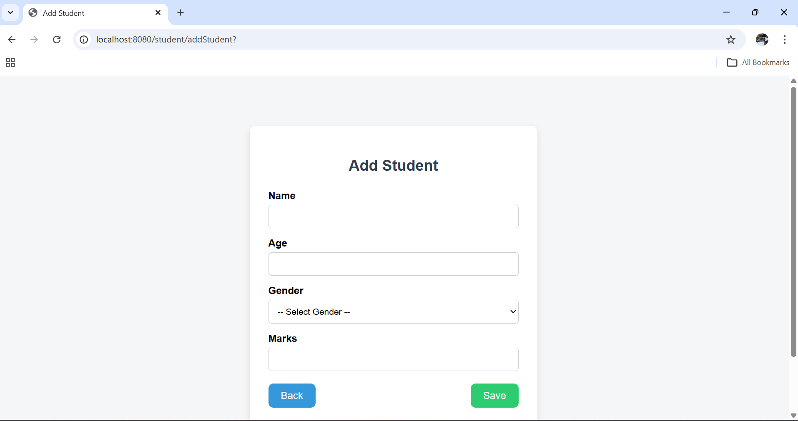
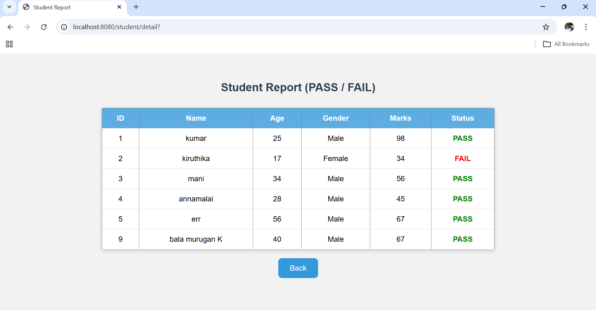
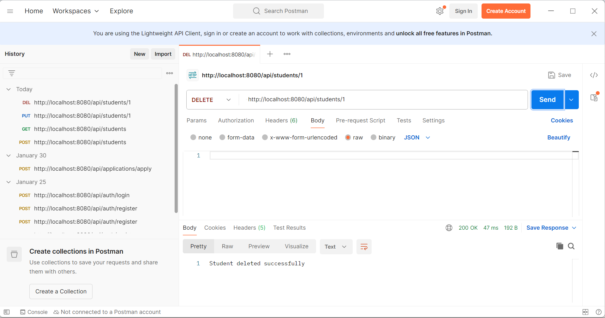

#  Student Management System

A full-stack **Student Management System** built using **Spring Boot** with both **Web Application** and **REST API** support. This project allows managing students through a web interface and programmatically via APIs.

##  Features

* Student login (web)
* Add student (web)
* Update student (web)
* Delete student (web)
* REST APIs for CRUD operations
* Clean layered architecture
* Recruiter-friendly documentation
* 
### Web Endpoints

- Login Page  
  http://localhost:8080/student/

- Add Student  
  http://localhost:8080/student/addStudent

- Save Student  
  http://localhost:8080/student/saveStudent

- Update Student (by ID)  
  http://localhost:8080/student/update/{

- Update Student  
  http://localhost:8080/student/update

- Delete Student  
  http://localhost:8080/student/delete/{id}

##  API Endpoints (REST API)

### REST API Endpoints

- POST  
  http://localhost:8080/api/students

- GET  
  http://localhost:8080/api/students

- PUT  
  http://localhost:8080/api/students/{id}

- DELETE  
  http://localhost:8080/api/students/{id}

##  Web Application Screenshots

##  API Screenshots

## Tech Stack

* Java
* Spring Boot
* Spring MVC
* Spring Data JPA
* Hibernate
* MySQL
* RESTful APIs
* HTML/CSS (Web Layer)
* Thymeleaf

## How to Run the Project

1. Clone the repository
2. Open in IntelliJ / Eclipse
3. Configure MySQL in application.properties
4. Run Spring Boot Application
5. Access Web App: http://localhost:8080/student/
6. Test APIs using Postman

##  Project Structure

student-management_Demo/
│
├── screenshots/
│   ├── api/
│   └── web/
│
├── src/
├── README.md
└── pom.xml

## Developer
**Boobathi Kumar N**
Java Backend Developer

##  Recruiter Note

This project demonstrates:

* Backend API development
* Full CRUD operations
* Web + API integration
* Clean code structure
* Real-world project architecture

